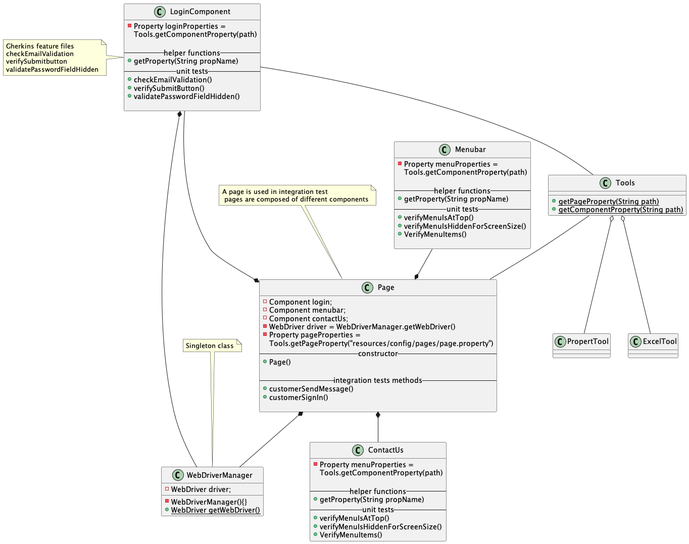

## Orange HRM Automation Project

In this project I am trying to automate the website <a href="https://opensource-demo.orangehrmlive.com/" >OrangeHRM</a>
using the following tools 

* Selenium -Java
* gradle build and automation tool 
* Cucumber for report generation, BDD using gherkins
* JUnit for assertion and unit test reports generation
* Jenkins for CI 

The first step was to setup project stucture as follows 


Code setup for test:


I wrote a custom gradle plugin that will be used to run custom 
test based on their annotations, this will be really helpful when it 
comes to CI 

to run custom test use 

```gradle automaton --runTests "@all or @network "```

Here @testType represent the test to be run, multiple test can be chained using or statements.